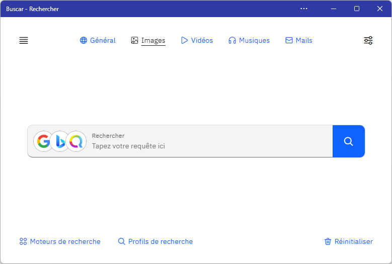

# Buscar

Buscar est une application écrite avec [Svelte](https://svelte.dev) en TypeScript. Ce projet est le successeur de [Doosearch](https://search.doocode.xyz).



## Développement

- Installer les dependencies :

*Note: pour réaliser les commandes suivantes, il est nécessaire que [Node.js](https://nodejs.org) soit installé.*

```bash
cd buscar
npm install
```

- Ensuite lancer [Rollup](https://rollupjs.org):

```bash
npm run dev
```

- Ouvrez un navigateur web à cette adresse : [localhost:5000](http://localhost:5000). Vous devrez voir l'application fonctionner. Modifier un fichier dans le répertoire `src`, enregistrez-le, et vous constaterez vos modifications dans votre navigateur.

Si vous utilisez [Visual Studio Code](https://code.visualstudio.com/), il est recommandé d'utiliser l'extension officielle [Svelte for VS Code](https://marketplace.visualstudio.com/items?itemName=svelte.svelte-vscode). Si vous utilisez un autre éditeur de code, vous pourrez avoir besoin d'installer des extensions pour avoir la coloration syntaxique et Intellisense.

## Compiler le projet

Pour créer une version optimisée de votre application, lancez la commande suivante :

```bash
npm run build
```

Les fichiers seront compilés dans /public.
